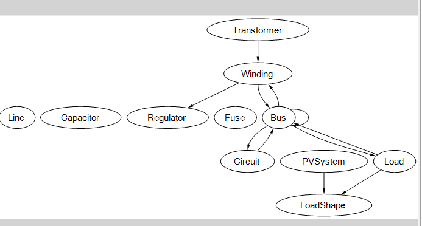
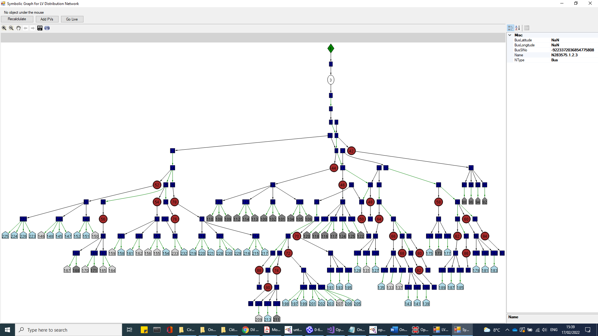

# Dist-Prog-V2 — Transparent Management of Dynamically Evolving Data in Smart Local Energy Systems

Reference implementation ("Prototype-B") built for the PhD thesis of the same theme at the
University of Bristol:

> **["Transparent Management of Dynamically Evolving Data in Smart Local Energy Systems"](https://research-information.bris.ac.uk/en/studentTheses/transparent-management-of-dynamically-evolving-data-in-smart-loca/)**
> Srinivasa Phani Chitti, PhD, University of Bristol, 2023. Supervisor: Ruzanna Chitchyan.

Smart local energy systems (renewable generation, EVs, building-integrated storage, ...) keep
changing shape: new device types, new data fields, new participants. Services built on top of that
data break every time the underlying structure evolves. This project explores decoupling service
delivery from evolving data sources with a **dynamic ontology**: a hierarchical, semantic
description of the system's data structures that evolves alongside the data itself, and against
which both old and newly proposed datasets are validated before being accepted.

Concretely, that means a set of **distributed nodes** that each hold a partition of shared
resources (an electrical distribution network, modeled in [OpenDSS](https://www.epri.com/pages/sa/opendss)),
reach **consensus by voting** before accepting a change to those resources, and validate proposed
data against a shared **RDF/OWL ontology** that itself evolves over time.

## Architecture

```
                 ┌─────────────────────────────────────────────┐
                 │              ResMngNetwork / Server           │
                 │  (one process per distributed node)            │
                 │                                                  │
  OpenDSS  ────▶ │  DataFileProcess ─▶ DSystem (DSNode)  ◀── vote/consensus ──▶ peer nodes
  circuit data   │        │                  │
 (OpenDSSCircuit)│        ▼                  ▼
                 │  KnowledgeGraph      ValidationService
                 │  (RDF/OWL, PBReasoner)  validates proposed datasets
                 │        │              against the ontology
                 │        ▼
                 │  RDFGraphWindow (graph visualization, via GLEE)
                 └─────────────────────────────────────────────┘
                                   ▲
                                   │ registers users / roles
                 ┌─────────────────────────────────────────────┐
                 │       EDMarketplace (WPF client)                │
                 │  Consumer / Prosumer / SmartUser registration   │
                 └─────────────────────────────────────────────┘
```

The ontology (`Ontology/opendsst22.owl`) models the electrical network domain — buses,
transformers, windings, loads, PV systems, regulators — see [`docs/ontology-spec.md`](docs/ontology-spec.md)
for the full class/property spec. Rendered, it looks like this:



Each node validates and evolves its view of the network the same way; a real run against the
sample LV distribution circuit in [`OpenDSSCircuit/`](OpenDSSCircuit) looks like this:



## Repository layout

| Path | What it is |
|---|---|
| [`ResMngNetwork/Server`](ResMngNetwork/Server) | The core system: distributed nodes, voting/consensus (`DSystem`), ontology reasoning (`KnowledgeGraph`, `PBReasoner`), dataset validation (`ValidationService`) |
| [`ResMngNetwork/ContractDataModels`](ResMngNetwork/ContractDataModels) | Shared WCF service/data contracts between nodes |
| [`OpenDSSCircuit`](OpenDSSCircuit) | Sample LV distribution circuit definitions (OpenDSS format) used as the underlying resource data |
| [`Ontology`](Ontology) | The OWL ontology describing the smart-grid domain model |
| [`Tools/SimulationTool`](Tools/SimulationTool) | OpenDSS parser + simulation engine used to process circuit data |
| [`EDMarketplace`](EDMarketplace) | WPF peer-to-peer energy marketplace UI (Consumer/Prosumer/SmartUser registration) |
| [`ConfigFolder`](ConfigFolder) | Per-node initial data for a 6-node distributed run (nodes `1`–`5` plus an authority node `AU1`) |
| [`Tools/`](Tools/README.md) *(rest)* | Technology trials (gRPC, WCF hosting, Web API, Neo4j) explored before settling on the WCF/RDF approach used above — not part of the running system, see [`Tools/README.md`](Tools/README.md) |
| [`vendor/`](vendor/README.md) | A handful of committed binaries with no available source/package (see that folder's README) |
| [`docs/`](docs) | Design notes, ontology spec, EDMarketplace DB schema |

## Tech stack

C# / .NET Framework 4.6.1, WPF, WCF (inter-node RPC + consensus messaging), a custom RDF/OWL
reasoner, MySQL (resource storage), OpenDSS (circuit simulation).

This predates .NET's move away from WCF — it's a research prototype from the framework's
contemporary tooling, not a recommendation for a production stack today. The ideas (dynamic
ontology-driven validation, voting-based consensus over partitioned resources) are the point, not
the specific RPC framework.

## Building & running

Requires Visual Studio 2017+ (or MSBuild) with .NET Framework 4.6.1 targeting pack, and NuGet
package restore enabled.

There's no single top-level solution — build the piece you want:

- **Core distributed system**: open `ResMngNetwork/ResMngNetwork.sln`, restore NuGet packages,
  build. `Server.csproj` depends on `ContractDataModels` and `ToolUtilities`/`DataSerailizer`
  build order — build `ContractDataModels` first if you hit a missing-reference error on a clean
  checkout.
- **Marketplace UI**: `EDMarketplace/EDMarketplaceV1/EDMarketplaceV1.sln`.
- **Simulation tool**: `Tools/SimulationTool/SimulationTool.sln`.
- A MySQL instance is expected for resource storage — schema for the marketplace side is in
  [`docs/edmarketplace-schema.sql`](docs/edmarketplace-schema.sql).
- To run a multi-node network locally, launch `Server.exe` once per entry under
  [`ConfigFolder/`](ConfigFolder) (`1`–`5`, `AU1`), pointing each instance at its corresponding
  config.

## Docs

- [`docs/design-notes.md`](docs/design-notes.md) — original design notes on the consensus/validation process model
- [`docs/ontology-spec.md`](docs/ontology-spec.md) — full ontology class/property specification
- [`docs/edmarketplace-schema.sql`](docs/edmarketplace-schema.sql) — marketplace MySQL schema

## Citation

If referencing this work:

```
Chitti, S. P. (2023). Transparent Management of Dynamically Evolving Data in Smart Local
Energy Systems. PhD thesis, University of Bristol.
https://research-information.bris.ac.uk/en/studentTheses/transparent-management-of-dynamically-evolving-data-in-smart-loca/
```

## License

No license is currently granted — all rights reserved. Code is shared here for review/portfolio
purposes; get in touch before reusing it.
